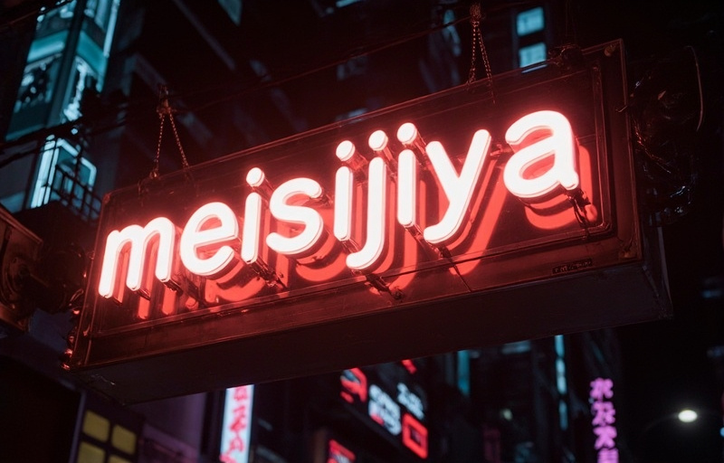

<!-- Banner with neon style "meisijiya" text -->

 

#  Hi there, I'm **meisijiya**

**`大三在校生 · Java/TS/Python爱好者`**

**`亲疏随缘 · Go with the flow`**

 

<!-- Typing animation for special message -->

 

<!-- K-On! images with scrolling effect -->
<marquee behavior="scroll" direction="left" scrollamount="3" width="100%">
  
  
</marquee>

 

## ✨ About Me

> _"大三在校生，热爱编程，希望有生之年可以掌握Java、TypeScript和Python。"_

- 🎓 **大三在校生** at university
- 📍 现居中国
- 💼 目前在学习 **Java**, **TypeScript**, **Python**
- ✍️ 折腾日常都写在博客 [**xn--ljhfjm-dl0o.top**](https://xn--ljhfjm-dl0o.top/)
- 💬 生活理念：_亲疏随缘_

 

## 🛠️ Tech Stack & Tools

<table>
  <tr>
    <td><b>Languages</b></td>
    <td>
      
      
      
    </td>
  </tr>
  <tr>
    <td><b>Frameworks</b></td>
    <td>
      
      
      
    </td>
  </tr>
  <tr>
    <td><b>Tools</b></td>
    <td>
      
      
      
    </td>
  </tr>
  <tr>
    <td><b>Databases</b></td>
    <td>
      
      
    </td>
  </tr>
</table>

 

## 📊 GitHub Statistics

 

<!-- Contribution Snake Animation -->

 

## 🔗 Badges & Links

 

**"我有个可爱女友，希望我们长长久久，事事顺意，健健康康，开开心心"**

